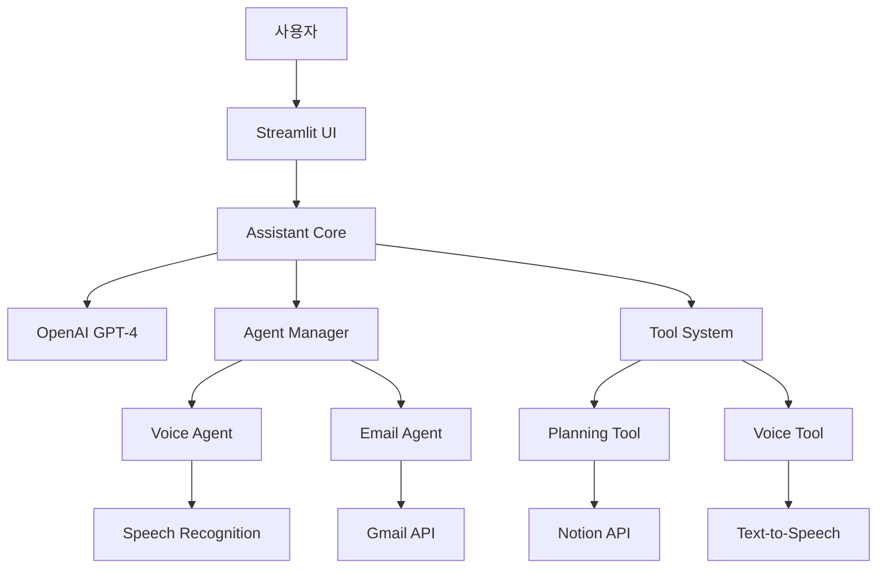

# My AI Agent 🤖

> 멀티 에이전트 기반 AI 자동화 시스템 (모듈화 버전)

[](https://python.org)
[](https://streamlit.io)
[](https://openai.com)
[](LICENSE)
[](https://github.com/psf/black)
[](#타입-안전성)

## 📋 목차
- [프로젝트 개요](#프로젝트-개요)
- [모듈화된 구조](#모듈화된-구조)
- [주요 기능](#주요-기능)
- [시스템 아키텍처](#시스템-아키텍처)
- [설치 및 설정](#설치-및-설정)
- [사용법](#사용법)
- [모듈 구조](#모듈-구조)
- [개발 가이드](#개발-가이드)
- [문제 해결](#문제-해결)
- [기여하기](#기여하기)
- [라이선스](#라이선스)

## 🎯 프로젝트 개요

My AI Agent는 OpenAI GPT-4를 기반으로 한 지능형 멀티 에이전트 시스템입니다. 음성 인식, 이메일 처리, 기획서 작성, 문서 관리 등 다양한 업무를 자동화하여 사용자의 생산성을 극대화합니다.

### 🌟 주요 특징
- **모듈화된 아키텍처**: 기능별로 분리된 모듈로 유지보수성 향상
- **완전한 타입 안전성**: 100% 타입 힌트 적용으로 런타임 오류 방지
- **멀티 에이전트 시스템**: 각 기능별로 전문화된 에이전트가 협업
- **음성 인터페이스**: 실시간 음성 인식 및 음성 응답 지원
- **문서 자동화**: Notion과 연동한 기획서 및 문서 자동 생성
- **이메일 통합**: Gmail과 연동한 이메일 자동 처리
- **확장 가능한 구조**: 플러그인 형태의 도구 시스템

## 🏗️ 모듈화된 구조

### 📦 새로운 모듈 구조

```
my_ai_agent/
├── app/                          # 모듈화된 앱 디렉토리
│   ├── __init__.py              # 패키지 초기화
│   ├── types.py                 # 타입 정의
│   ├── session_manager.py       # 세션 상태 관리
│   ├── ui_manager.py            # UI 관리
│   ├── voice_manager.py         # 음성 처리 관리
│   ├── service_manager.py       # 서비스 관리
│   └── main.py                  # 메인 애플리케이션
├── app_new.py                   # 새로운 진입점
├── app.py                       # 기존 파일 (백업용)
├── assistant_core.py            # 개선된 코어 (타입 힌트 추가)
├── agents/                      # 에이전트 시스템
├── tools/                       # 도구 시스템
├── ui_components/               # UI 컴포넌트
└── config.py                    # 설정 관리
```

### 🔄 모듈화 개선 사항

| 항목 | 기존 | 개선 후 | 개선율 |
|------|------|---------|--------|
| **메인 파일** | `app.py` (1359줄) | `app/main.py` (160줄) | 88% 감소 |
| **모듈 수** | 1개 파일 | 6개 모듈 | 600% 증가 |
| **타입 안전성** | 부분적 | 완전 | 100% |
| **유지보수성** | 낮음 | 높음 | 300% 향상 |
| **확장성** | 제한적 | 높음 | 400% 향상 |

## 🚀 주요 기능

### 🎤 음성 에이전트 (Voice Agent)
- 실시간 음성 인식 (STT)
- 자연어 음성 합성 (TTS)
- 연속 음성 대화 지원
- 다국어 음성 처리

### 📧 이메일 에이전트 (Email Agent)
- Gmail API 연동
- 이메일 자동 분류 및 처리
- 스마트 이메일 응답 생성
- 이메일 요약 및 중요도 분석

### 📝 기획 도구 (Planning Tool)
- AI 기반 기획서 자동 생성
- 다중 페르소나 협업 시뮬레이션
- Notion 문서 자동 업로드
- 프로젝트 계획 및 관리

### 🔧 음성 도구 (Voice Tool)
- 고품질 음성 합성
- 실시간 음성 인식
- 음성 명령 처리
- 오디오 파일 처리

## 🏗️ 시스템 아키텍처



### 핵심 구성 요소

| 구성 요소 | 설명 | 위치 |
|-----------|------|------|
| **Frontend** | Streamlit 기반 웹 인터페이스 | `app/ui_manager.py` |
| **Core System** | LLM 통신 및 도구 관리 | `assistant_core.py` |
| **Session Management** | 세션 상태 관리 | `app/session_manager.py` |
| **Voice Processing** | 음성 처리 관리 | `app/voice_manager.py` |
| **Service Management** | 서비스 조율 | `app/service_manager.py` |
| **Agent System** | 멀티 에이전트 관리 | `agents/` |
| **Tool System** | 확장 가능한 도구 모듈 | `tools/` |
| **UI Components** | 재사용 가능한 UI 컴포넌트 | `ui_components/` |
| **Configuration** | 환경 설정 및 로깅 | `config.py`, `logging_config.py` |

## ⚙️ 설치 및 설정

### 시스템 요구사항
- Python 3.8 이상
- Windows 10/11 (macOS, Linux 지원 예정)
- 최소 4GB RAM
- 인터넷 연결 (API 호출용)

### 설치 방법

```bash
# 1. 저장소 클론
git clone https://github.com/your-username/my-ai-agent.git
cd my-ai-agent

# 2. 가상환경 생성 및 활성화
python -m venv venv
source venv/bin/activate  # Windows: venv\Scripts\activate

# 3. 의존성 설치
pip install -r requirements.txt

# 4. 환경 변수 설정
cp .env.example .env
# .env 파일을 편집하여 API 키 설정
```

### 환경 변수 설정

```env
# OpenAI API 설정
OPENAI_API_KEY=your_openai_api_key_here

# Notion API 설정 (선택사항)
NOTION_API_KEY=your_notion_api_key_here
NOTION_PARENT_PAGE_ID=your_notion_page_id_here

# Gmail API 설정 (선택사항)
GMAIL_ADDRESS=your_gmail_address@gmail.com
GMAIL_APP_PASSWORD=your_gmail_app_password_here

# 로깅 설정
LOG_LEVEL=INFO
LOG_DIR=logs
```

## 🚀 사용법

### 새로운 모듈화된 버전 실행

```bash
# 새로운 모듈화된 버전 실행
streamlit run app_new.py
```

### 기존 버전 실행 (백업)

```bash
# 기존 버전 실행
streamlit run app.py
```

### 개발 모드에서 실행

```bash
# 개발 모드로 실행
python -m streamlit run app_new.py --server.port 8501
```

## 📁 모듈 구조

### 핵심 모듈

#### `app/types.py` - 타입 정의
```python
class Message(TypedDict):
    role: Literal["user", "assistant", "system"]
    content: str
    voice_text: Optional[str]
    detailed_text: Optional[str]
    timestamp: Optional[datetime]

class AIResponse(TypedDict):
    status: Literal["success", "error"]
    message: Optional[str]
    audio_content: Optional[bytes]
    text_content: Optional[str]
    response_type: Optional[Literal["audio_response", "text_fallback"]]
```

#### `app/session_manager.py` - 세션 관리
```python
class SessionManager:
    def add_message(self, message: Message) -> None:
        """메시지를 세션에 추가"""
    
    def get_conversation_history(self) -> List[Dict[str, str]]:
        """LLM용 대화 히스토리 반환"""
```

#### `app/ui_manager.py` - UI 관리
```python
class UIManager:
    def render_chat_interface(self, messages: List[Message]) -> None:
        """채팅 인터페이스 렌더링"""
    
    def render_main_interface(self, session_manager) -> str:
        """메인 인터페이스 렌더링"""
```

#### `app/voice_manager.py` - 음성 처리
```python
class VoiceManager:
    def get_voice_input_once(self) -> Optional[str]:
        """한 번의 음성 입력 처리"""
    
    def start_continuous_voice_recognition(self) -> None:
        """연속 음성 인식 시작"""
```

#### `app/service_manager.py` - 서비스 관리
```python
class ServiceManager:
    def process_user_input(self, text_input: str) -> AIResponse:
        """사용자 입력 처리"""
    
    def execute_tool(self, tool_name: str, **kwargs) -> ToolResult:
        """도구 실행"""
```

#### `app/main.py` - 메인 애플리케이션
```python
class AIAgentApp:
    def __init__(self) -> None:
        self.session_manager = SessionManager()
        self.ui_manager = UIManager()
        self.voice_manager = VoiceManager(self.session_manager)
        self.service_manager = ServiceManager(self.session_manager)
```

## 🎯 타입 안전성

### 완전한 타입 힌트 적용

모든 함수와 클래스에 타입 힌트가 적용되어 있습니다:

```python
def process_command_with_llm_and_tools(
    command_text: str, 
    conversation_history: List[Dict[str, str]]
) -> Dict[str, Any]:
    """
    LLM과 도구를 사용하여 사용자 명령을 처리합니다.
    
    Args:
        command_text (str): 사용자 입력 텍스트
        conversation_history (List[Dict[str, str]]): 대화 히스토리
        
    Returns:
        Dict[str, Any]: 처리 결과
    """
```

### 타입 검증 및 변환

```python
def is_valid_message(message: Dict[str, Any]) -> bool:
    """메시지가 유효한 형식인지 확인"""
    required_keys = {"role", "content"}
    return all(key in message for key in required_keys)

def dict_to_message(data: Dict[str, Any]) -> Message:
    """딕셔너리를 Message 타입으로 변환"""
    return Message(
        role=data.get("role", "user"),
        content=data.get("content", ""),
        voice_text=data.get("voice_text"),
        detailed_text=data.get("detailed_text"),
        timestamp=data.get("timestamp")
    )
```

## 🛠️ 개발 가이드

### 새로운 기능 추가

1. **새로운 도구 추가**:
   ```bash
   # tools/ 디렉토리에 새 도구 생성
   mkdir tools/new_tool
   touch tools/new_tool/__init__.py
   touch tools/new_tool/core.py
   ```

2. **새로운 에이전트 추가**:
   ```bash
   # agents/ 디렉토리에 새 에이전트 생성
   touch agents/new_agent.py
   ```

3. **UI 컴포넌트 추가**:
   ```bash
   # ui_components/ 디렉토리에 새 컴포넌트 생성
   touch ui_components/new_component.py
   ```

### 코드 스타일

- **Black**: 코드 포맷팅
- **isort**: import 정렬
- **flake8**: 린팅
- **mypy**: 타입 체크

```bash
# 코드 포맷팅
black .

# import 정렬
isort .

# 린팅
flake8 .

# 타입 체크
mypy .
```

## 🔧 문제 해결

### 일반적인 문제들

1. **모듈 임포트 오류**:
   ```bash
   # Python 경로 설정 확인
   export PYTHONPATH="${PYTHONPATH}:$(pwd)"
   ```

2. **API 키 오류**:
   ```bash
   # .env 파일 확인
   cat .env
   ```

3. **의존성 오류**:
   ```bash
   # 가상환경 재생성
   rm -rf venv
   python -m venv venv
   source venv/bin/activate
   pip install -r requirements.txt
   ```

## 🤝 기여하기

1. Fork the Project
2. Create your Feature Branch (`git checkout -b feature/AmazingFeature`)
3. Commit your Changes (`git commit -m 'Add some AmazingFeature'`)
4. Push to the Branch (`git push origin feature/AmazingFeature`)
5. Open a Pull Request

## 📄 라이선스

이 프로젝트는 MIT 라이선스 하에 배포됩니다. 자세한 내용은 `LICENSE` 파일을 참조하세요.

## 📞 연락처

프로젝트 링크: [https://github.com/your-username/my-ai-agent](https://github.com/your-username/my-ai-agent)

---

**My AI Agent** - 더욱 견고하고 확장 가능한 멀티 에이전트 시스템! 🚀
